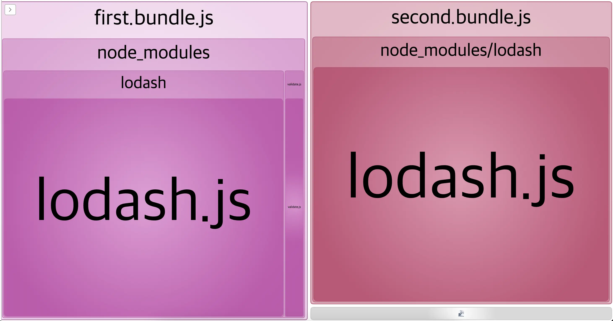
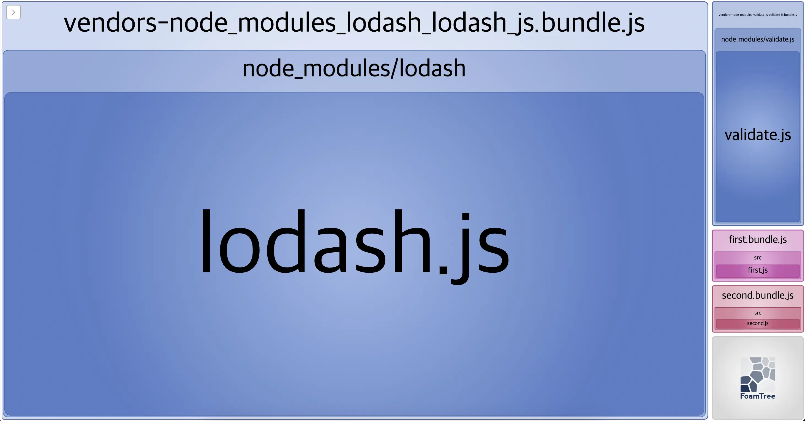

# Optimization

여러 페이지에 중복으로 사용하는 library는 caching 되도록 별도의 .js 파일로 뺄 수 있다.\
아래와 같이 `optimization` 속성을 넣으면 알아서 해준다.

```
optimization: {
  splitChunks: {
    chunks: 'all',
  }
}
```

comment 처리한 `BundleAnalyzerPlugin` 을 활성화 시키고 build하면 시각적으로 bundle 사이즈를 확인할 수 있다.

**optimization을 하지 않았을 때**



**optimization을 했을 때**



## Build Script

`npx webpack --config webpack.config.js --mode development`
